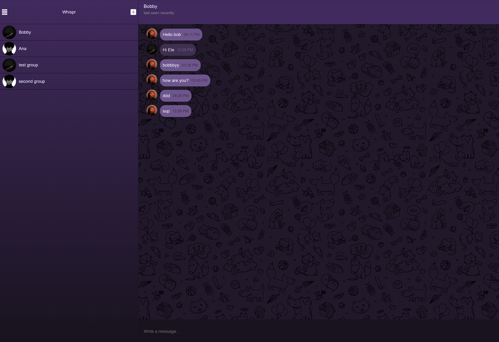
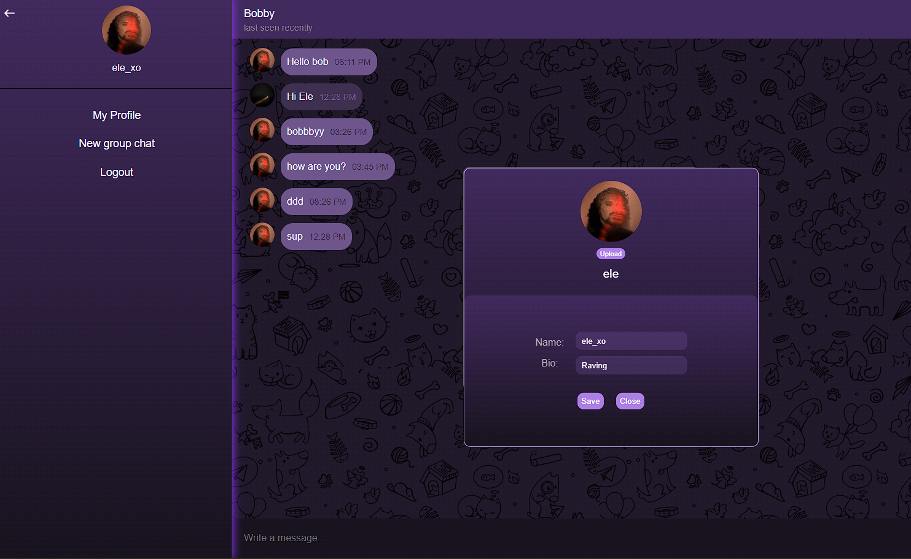

# 📩 Messenger App

A full-stack real-time messaging application with authentication, group chats, file uploads, and live updates using **Socket.io**. Built with a modern JavaScript stack and modular architecture.
This project is part of The Odin Project curriculum.

---
### Login

### Chat View

### Bio View

---
## 🚀 Tech Stack

### **Frontend**
| Tech | Description |
|------|-------------|
|  | React + Vite |
|  | TailwindCSS |
|  | Socket.io client |

### **Backend**
| Tech | Description |
|------|-------------|
|  | Node.js + Express |
|  | Prisma ORM |
|  | PostgreSQL |
|  | Multer file uploads |
|  | Socket.io server |

> **Note:** The backend lives in its own repository:  
> [https://github.com/ELE-00/messenger-api](https://github.com/ELE-00/messenger-api)
---

## 📱 Features

### **Authentication**
- Register & login  
- Secure password hashing  
- Unique usernames  
- Optional profile picture upload  

### **Conversations**
- One-to-one chats  
- Group chats with editable members  
- Group profile picture upload  
- Fetch all user conversations  
- Live updates on new chats  

### **Messages**
- Real-time messaging  
- Text messages  
- Image uploads  
- Seen/unseen tracking  
- Infinite scrolling chat history  
- Socket.io live events  

### **User Interface**
- Responsive design  
- Conversation list with last-message preview  
- Chat window with timestamps, status, and images  
- Dark/light mode  

---

Built with ❤️, ☕, and too many console.log() statements
